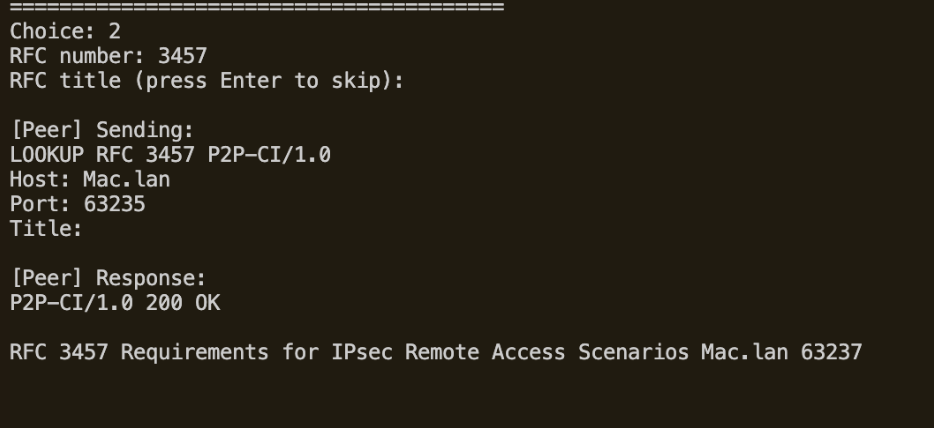

# P2P-CI: Peer-to-Peer System with Centralized Index
**CSC/ECE 573 – Internet Protocols | Project #1 | Spring 2026**

---

## Overview

This project implements a Peer-to-Peer system with a Centralized Index (P2P-CI) for downloading RFC (Request for Comments) documents. Peers share RFC files directly with each other, while a central server maintains an index of which peer has which RFC.

All communication happens over TCP using two custom application-layer protocols:
- **P2S (Peer-to-Server):** ADD, LOOKUP, LIST
- **P2P (Peer-to-Peer):** GET

---

## File Structure

```
p2p-ci/
├── server.py          # Centralized index server
├── peer.py            # Peer node (upload server + client)
├── Makefile           # Build and run instructions
├── README.md          # This file
├── screenshots/       # Demo screenshots
├── peer1/
│   └── rfcs/
│       ├── rfc2345.txt
│       └── rfc3457.txt
└── peer2/
    └── rfcs/
        ├── rfc123.txt
        └── rfc3457.txt
```

---

## Requirements

- Python 3.x
- No external libraries (uses Python standard library only)

---

## How to Run

### Step 1 — Start the Server
```bash
make run-server
# or:
python3 server.py
```
Listens on well-known port **7734**.

### Step 2 — Start Peer 1 (new terminal)
```bash
make run-peer1 HOST=localhost
# or:
cd peer1 && python3 ../peer.py localhost
```

### Step 3 — Start Peer 2 (new terminal)
```bash
make run-peer2 HOST=localhost
# or:
cd peer2 && python3 ../peer.py localhost
```

Each peer automatically:
1. Starts an upload server on a random OS-assigned port
2. Connects to the server at port 7734
3. Registers all RFCs found in its local `rfcs/` directory

---

## Application Protocols

### P2S Protocol (Peer ↔ Server)

**Request format:**
```
METHOD RFC <number> P2P-CI/1.0\r\n
Host: <hostname>\r\n
Port: <upload-port>\r\n
Title: <rfc-title>\r\n
\r\n
```

| Method | Purpose |
|--------|---------|
| ADD | Register a locally available RFC with the server |
| LOOKUP | Find all peers that have a specific RFC |
| LIST | Get the full RFC index from the server |

**Response format:**
```
P2P-CI/1.0 <status-code> <phrase>\r\n
\r\n
RFC <number> <title> <hostname> <port>\r\n
...\r\n
\r\n
```

### P2P Protocol (Peer ↔ Peer)

**Request format:**
```
GET RFC <number> P2P-CI/1.0\r\n
Host: <hostname>\r\n
OS: <operating-system>\r\n
\r\n
```

**Response format:**
```
P2P-CI/1.0 <status-code> <phrase>\r\n
Date: <date>\r\n
OS: <os>\r\n
Last-Modified: <date>\r\n
Content-Length: <bytes>\r\n
Content-Type: text/plain\r\n
\r\n
<file contents>
```

### Status Codes

| Code | Phrase | Meaning |
|------|--------|---------|
| 200 | OK | Success |
| 400 | Bad Request | Malformed request |
| 404 | Not Found | RFC not found |
| 505 | P2P-CI Version Not Supported | Wrong protocol version |

---

## Peer Menu

```
1. ADD    — manually register an RFC with the server
2. LOOKUP — find which peers have a specific RFC
3. LIST   — view all RFCs registered across all peers
4. GET    — download an RFC from another peer (LOOKUP + GET + ADD)
5. EXIT   — disconnect from server and quit
```

---

## Download Flow (Choice 4)

```
User selects 4
    │
    ├─► LOOKUP  → asks server "who has RFC X?"
    │           ← server replies with peer hostnames + upload ports
    │
    ├─► GET     → opens NEW TCP connection directly to peer's upload port
    │           ← peer sends headers + file over same connection
    │             connection closed after transfer
    │
    └─► ADD     → tells server "I now have RFC X too"
                  server updates its index
```

---

## Demo Scenarios

---

### Scenario 1 — Server Startup and Peer Registration

The server starts on port 7734. When peers connect, they register their RFCs using ADD requests. The server updates its peer list and RFC index and responds `200 OK`.

**Server — receives peer1's ADD request:**


- New TCP connection logged immediately
- ADD request received in correct protocol format
- Peer registered: `[Server] Added Mac.lan:63235`
- RFC added to index: `[Server] Added RFC 2345 from Mac.lan`
- Response sent: `P2P-CI/1.0 200 OK` with echoed RFC data line

**Peer 1 — connects and registers RFCs:**


- Upload server starts on random port 63235
- Connects to server at port 7734
- Auto-registers RFC 2345 and RFC 3457
- Full ADD request printed in protocol format
- Server's `200 OK` response with RFC data displayed

**Server — receives peer2's ADD requests:**


- Server handles both peers concurrently in separate threads
- Peer 2 registers RFC 3457 and RFC 123 independently

---

### Scenario 2 — LIST ALL

A peer queries the server for the complete RFC index across all active peers.


**Request sent:**
```
LIST ALL P2P-CI/1.0
Host: Mac.lan
Port: 63235
```

**Response received:**
```
P2P-CI/1.0 200 OK

RFC 123 A Proferred Official ICP Mac.lan 63237
RFC 3457 Requirements for IPsec Remote Access Scenarios Mac.lan 63237
RFC 2345 Domain Names and Company Name Retrieval Mac.lan 63235
```

All 3 RFCs from both peers returned — RFC number, title, hostname, and upload port for each entry.

---

### Scenario 3 — LOOKUP

A peer looks up which peers have a specific RFC.



**Request sent:**
```
LOOKUP RFC 3457 P2P-CI/1.0
Host: Mac.lan
Port: 63235
Title:
```

**Response received:**
```
P2P-CI/1.0 200 OK

RFC 3457 Requirements for IPsec Remote Access Scenarios Mac.lan 63237
```

Server returns hostname and upload port of every peer that has RFC 3457.

---

### Scenario 4 — GET (200 OK) — Peer-to-Peer File Download

Peer 1 downloads RFC 3457 directly from Peer 2 over a new TCP connection to Peer 2's upload port.

**Peer 1 — downloader side:**


Full flow on Peer 1:
1. LOOKUP → server returns Peer 2's upload port (63237)
2. GET request sent directly to Peer 2:
```
GET RFC 3457 P2P-CI/1.0
Host: Mac.lan
OS: Darwin 24.3.0
```
3. Peer 2 responds with all 5 required headers + file:
```
P2P-CI/1.0 200 OK
Date: Sun, 26 Apr 2026 21:30:16 GMT
OS: Darwin 24.3.0
Last-Modified: Fri, 17 Apr 2026 16:08:18 GMT
Content-Length: 1839
Content-Type: text/plain
```
4. File saved: `rfcs/rfc3457.txt (1839 bytes)`
5. ADD sent to server → server now knows Peer 1 also has RFC 3457

**Peer 2 — uploader side:**


Peer 2's upload server (background thread) receives the GET and serves the file:
```
[UPLOAD] Request from ('192.168.1.241', 63245):
GET RFC 3457 P2P-CI/1.0
Host: Mac.lan
OS: Darwin 24.3.0
[UPLOAD] Sent RFC 3457 to ('192.168.1.241', 63245) (1839 bytes)
```

---

### Scenario 5 — 404 Not Found

A peer requests an RFC that does not exist in the system.


```
LOOKUP RFC 4342 P2P-CI/1.0
Host: Mac.lan
Port: 63237

Response: P2P-CI/1.0 404 Not Found
```

Server returns `404 Not Found` when no active peer has the requested RFC.

---

### Scenario 6 — 400 Bad Request

A client sends a request with an invalid/unrecognized method.


```bash
printf "BLAH RFC 123 P2P-CI/1.0\r\nHost: localhost\r\nOS: Mac\r\n\r\n" | nc localhost 63237
```
```
P2P-CI/1.0 400 Bad Request
```

The peer's upload server rejects any request that does not conform to the protocol format.

---

### Scenario 7 — 505 P2P-CI Version Not Supported

A client sends a request with an unsupported protocol version.


```bash
printf "GET RFC 123 P2P-CI/2.0\r\nHost: localhost\r\nOS: Mac\r\n\r\n" | nc localhost 63237
```
```
P2P-CI/1.0 505 P2P-CI Version Not Supported
```

Only `P2P-CI/1.0` is accepted. Any other version is rejected immediately.

---

### Scenario 8 — Peer Removal on Disconnect

When a peer exits, the server removes all associated records from both the peer list and the RFC index.

**Peer 1 exits cleanly:**


Peer 1 selects option 5 → `[PEER] Disconnecting...` → TCP connection closed.

**Server removes Peer 1's records:**


```
[SERVER] Peer Mac.lan:63235 left. Removed 1 peer(s), 2 RFC(s).
```

**Peer 2 runs LIST — only Peer 2's RFCs remain:**


```
P2P-CI/1.0 200 OK

RFC 123 A Proferred Official ICP Mac.lan 63237
RFC 3457 Requirements for IPsec Remote Access Scenarios Mac.lan 63237
```

Peer 1's RFC 2345 is gone — server correctly cleaned up all records on disconnect.

---

## Concurrency

The server uses Python threading — each peer connection runs in a dedicated thread. A `threading.Lock` protects the shared peer list and RFC index from race conditions.

The peer's upload server also runs in a background thread, allowing it to serve simultaneous download requests from other peers while the user interacts with the menu.

To test: start 3 or more peers simultaneously — all connect, register, and interact with the server independently without blocking each other.

---

## Testing Error Cases

```bash
# 404 Not Found — RFC does not exist on that peer
printf "GET RFC 9999 P2P-CI/1.0\r\nHost: localhost\r\nOS: Mac\r\n\r\n" | nc localhost <upload_port>

# 400 Bad Request — malformed/unrecognized method
printf "BLAH RFC 123 P2P-CI/1.0\r\nHost: localhost\r\nOS: Mac\r\n\r\n" | nc localhost <upload_port>

# 505 Version Not Supported — wrong protocol version
printf "GET RFC 123 P2P-CI/2.0\r\nHost: localhost\r\nOS: Mac\r\n\r\n" | nc localhost <upload_port>
```

`<upload_port>` is printed at peer startup: `[UPLOAD] Upload server listening on port XXXXX`
